# How Git Works

[From pluralsight: 《How Git Works》-- by Paolo Perrotta](https://app.pluralsight.com/library/courses/how-git-works/table-of-contents)

> 什么是Git？
> * Git is a distributed revision control system——分布式版本控制系统；
> * Git is a revision control system——版本控制系统；
> * Git is a stupid content tracker——傻叉文本追踪器；
> * Git is a persistent map, a simple structure that maps keys to values——持久化的映射。

## 一. 什么是Git？

### 1. Git是映射: 从SHA1到Bytes

> git hash-object

映射(map)，意味着有__键值对__，即__keys__和__values__。

在Git中，values是sequences of bytes——文本文件或者二进制文件等，而keys是SHA1 hash。

Git会根据你提供的对象，运用SHA1算法，计算出相应的__独一无二__的SHA1码——20 bytes in hexadecimal format, so they are a sequence of 40 hex digits.

可以使用命令行来计算一个字符串的SHA1，这需要用到low-level plumbing command——`git hash-object`。但不可以直接`git hash-object "apple pie"`，需要`echo "apple pie" | git hash-object --stdin`。


The same content, the same SHA1——内容一样，则SHA1一样。Git中的每一个对象都有一个SHA1。SHA1不会重复——SHA1s are unique。

### 2. Git是持久性映射

> * git init：创建仓库
> * git cat-file -p [SHA1]
> * Blob

Git是持久化映射(persistent map). Where does persistence come from? 

Git可以将数据保存到自己的仓库(Repo)里：`echo "apple pie" | git hash-object --stdin -w`，Git will save this piece of content in its repository。但是该目录下还没有Git的Repo，因此需要使用`git init`在该目录下新建Repo。

执行`git init`。使用`ls -a`发现，目录下出现了一个隐藏文件夹`.git`，标志着Repo的成功创建。此时就可以使用刚才的命令在该Repo下持久化数据了。

打开该隐藏文件夹，接着打开objects文件夹，找到数字那个文件夹（数字是SHA1的前两位），打开，里面出现了一个以SHA1（准确的说是缺了前两位的SHA1）为文件名的文件，刚才的数据就储存在这个文件里——这个文件在Git中被称为__Blob__。

该文件不能被直接打开，因为数据是经压缩后储存的，需要使用`git cat-file [SHA1] -p`查看

So far, we have seen that Git is able to take any piece of content, generate a key for it, a SHA1, and then persist the content into the repository as a blob, a persistent map——Git可以将一块内容，生成一个SHA1，组成一个映射，并持久化到仓库里形成一个blob。

### 3. Git的提交(Commit)操作

> * git status
> * git add [名称]
> * git commit -m [注释]
> * git log
> * Tree：Content是“旗下”的文件或目录的SHA1

We have seen that Git is a persistent map, but you probably don't see it as a map, you see it as something more than that, something that tracks your files, and your directories, a content tracker.

首先，我们创建一个这样的文件夹：
```
cookbook
|__menu.txt
|__recipes
	|__README.txt
	|__apple_pie.txt
```

然后我们用`git init`在该项目下创建Repo。完成后出现`.git`文件夹。

使用`git status`可以看到menu.txt和recipes文件夹都是红色的，是untracked状态。我们需要先将其导入staging area——使用`git add [文件\目录名]`。

再次使用`git status`可以看到变绿了，说明已经进入staging area，可以准备提交了。此时使用`git commit -m [备注]`提交即可。

再次使用`git status`可以看到stage是干净的了。

使用`git log`查看__提交历史__：
```
commit 7091a047be05f5e0f6d547656524aa6f3f976658 (HEAD -> master)
Author: LobbyBoy-Dray <gjw2014sis@163.com>
Date:   Thu Feb 28 00:23:28 2019 +0800

    first commit
```

这里，我们可以拿到此次提交的SHA1。使用`git cat-file -p [SHA1]`查看此次提交的信息：
```
tree cc121029c9e1e1a70420857b7f3d614acf8be976
author LobbyBoy-Dray <gjw2014sis@163.com> 1551284608 +0800
committer LobbyBoy-Dray <gjw2014sis@163.com> 1551284608 +0800

first commit
```

所以，commit的实质是什么？It's a simple and very short piece of text, nothing else——commit不过是一段文本，内含：①tree；②author；③time；④comment。其中，__Tree__十分重要。__Tree也是一个SHA1-Content键值对，表示Git存储的目录，就像blob是Git存储的文件__。The commit is pointing at the root directory of the project——Commit指向项目的根目录，因此这个tree就是项目根目录的SHA1。

我们再次使用`git cat-file -p`打开根目录的SHA1，发现里面储存了一个blob和一个tree的SHA1——即其下的文件和文件夹。再次使用上述命令，可以跟踪至最后一个文本文件里面的内容。如下图所示：

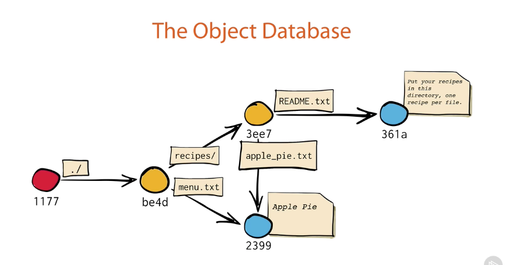

### 4. Git的版本控制功能

> parent

修改项目后，相关的变动文件会被Git识别到，需要你去stage并commit：
* 先`git add [name]`
* 再`git commit -m [info]`
* `git log`可以查看所有的提交信息，最近的最靠前

从第二次提交开始，commit的信息里除了根目录tree，还有一个__parent__——指向上一次的commit——__commits are linked__，即“提交”之间是连接起来的。

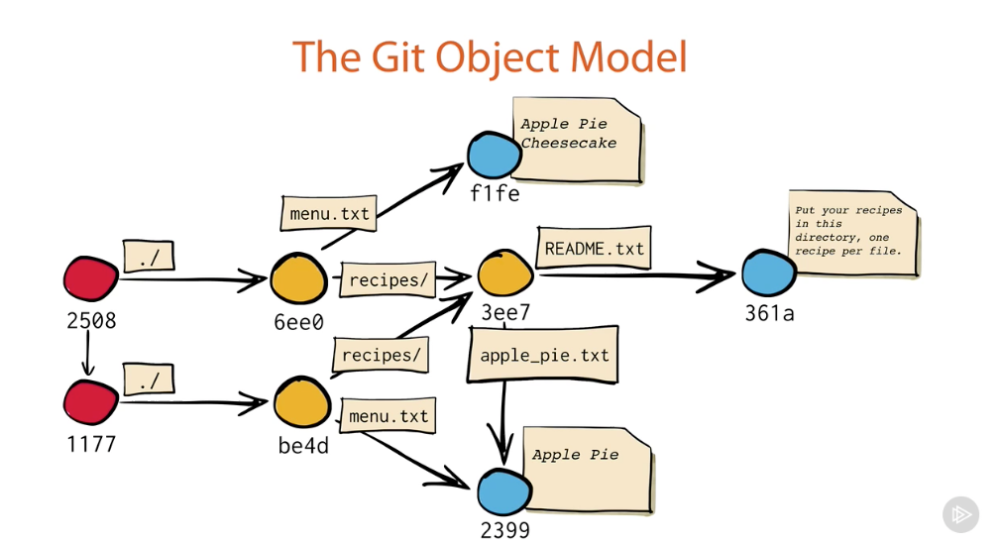

如果内容没有变，则SHA1不会变；如果内容发生变化，SHA1改变。

### 5. 含附注标签: Annotated Tags

标签(Tag)：A tag is like a label for the current state of the project：
* 轻量级标签：lightweight tag
* 含附注标签：annotated tag，the one that come with a message

使用`git tag -a [标签名] -m [信息]`来创建含附注标签。

In fact an annotated tag is also an object in Git's object database like a commit——标签和提交类似，也是Git对象。

使用`git cat-file -p [tag名]/[tag SHA1]`查看tag的内容——It contains metadata such as the tag's message, the name, the tagger, the date, and most importantly an object that the tag is pointing to——它也指向某个对象！In this case it's a commit.

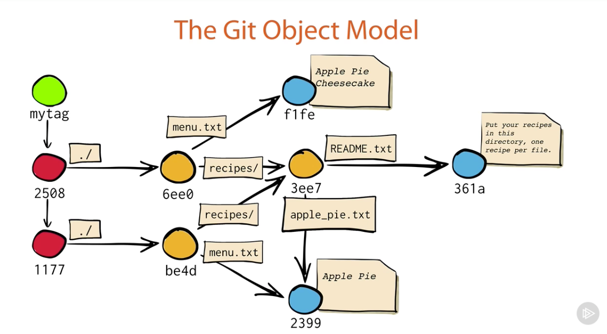

所以，tags是a simple label attached to an object.

### 6. 小结

Git有四种对象：Git对象都是键值对，键是SHA1，值是文本数据

* Blob：表示文件，内容是“文件内容”；
* Tree：表示目录，内容是“内部对象的SHA1”；
* Commit：表示提交，内容是“提交信息+提交后版本根目录的SHA1”；
* Annotated tag：带附注标签，内容是“标签内容+连接的对象的SHA1”；

## 二. Git中的分支: Branch

### 1. 分支的实质

> Branch的实质是：Reference to a commit，内含最近一次Commit的SHA1。

Git会在我们第一次做提交动作时，创建一个branch。使用`git branch`查看所有的branch。发现，这个创建的默认branch叫做`master`。

Git将branch放在`./.git/refs/heads`中。可以在heads文件夹中看到master文件，且该文件没有被压缩，可直接打开——是一个SHA1——是最近一次Commit的SHA1。

因此，A branch is just a reference to a commit——分支是提交的引用——a pointer to a commit——指向一个提交。


使用`git branch [分支名]`创建新的分支。

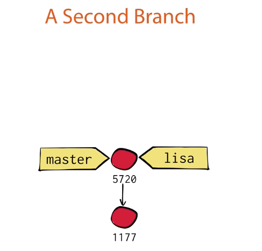

### 2. 当前分支: HEAD

> HEAD是当前Branch的引用，内含当前Branch的名称
>
> git checkout

在`git branch`中，当前分支会被__星号__标记。

Git怎么知道当前处于哪个分支？当前分支会被存储在`./.git/HEAD`中，可以直接打开查看——HEAD is just a reference to a branch。

此时，我们修改一个文件，并提交修改，发生的事情如下：

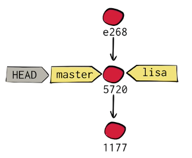

↓

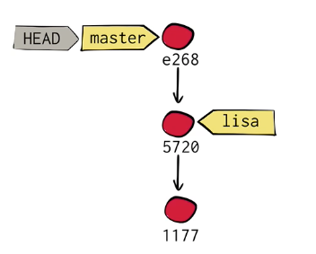

master branch指向的commit改变了，但是HEAD指向没变，还是指向master。

使用`git checkout [分支名]`改变当前分支：

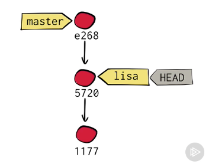

此时，Working area返回到之前的状态，即文件还未被修改（因为一个Commit就相当于一个历史版本）。

因此，Checkout的作用是：
* move HEAD
* updating the working area

此时如果进行修改并提交，则：

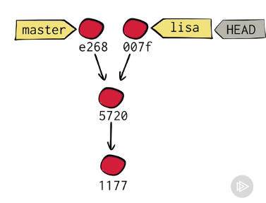

### 3. 分支合并: Merge

让我们使用`git checkout master`回到默认分支：

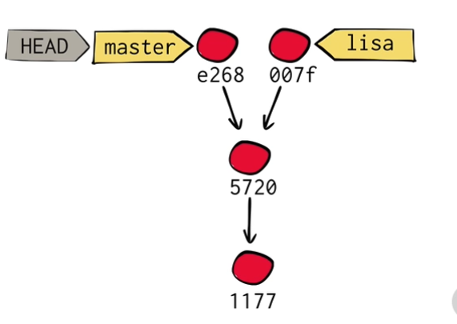

使用命令`git merge lisa`以合并分支。合并时可能发生conflict。打开发生冲突的文件，我们发现冲突处会被Git贴心地标记出来，你要进行修改：

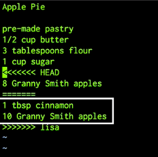

处理完毕后，需要stage再提交，此时不用添加提交注释。

合并提交的commit有两个parent：

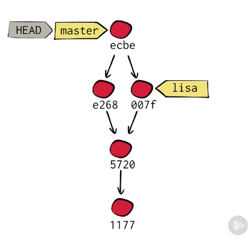

小结：Merge命令会创建一个新的commit，并把当前分支移动到该commit上。

### 4. 回顾Blob与Tree

Git的四种对象：blob、tree、commit、annotated tag之间，是reference关系。

Commits之间的references用来__追溯历史（content）__，其他references用来__追溯内容（content）__。

Git mostly doesn't care about your working directory——Git并不关注你的工作区域，因为工作区域可以通过`.git`中的数据文件生成。

在做checkout转换分支的操作时，Git只是把之前存储在database中对象里的内容拿了出来并展示给你——“备份的历史版本”。

### 5. “非合并”的合并: Fast-Forward

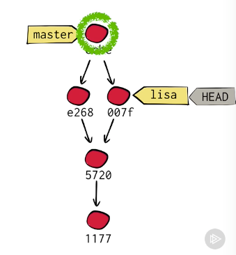

要将master分支合并到lisa分支上——刚才已经在处理完冲突的基础上，将lisa合并到master上了。因此，此次合并并不会产生新的东西。

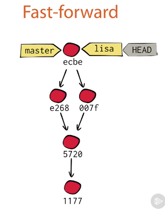

### 6.头分离: Detached HEAD

回忆，checkout是转换当前分支的方法，因为checkout后面应该跟着分支名称。然而，我们可以直接checkout一个commit，如下：

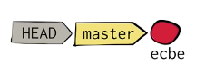

↓

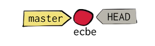

“当前”，我们并不在某个branch上，而是直接在某个commit上——Detached HEAD。

在Detached HEAD时，我们可以对代码安全地进行很多实验：

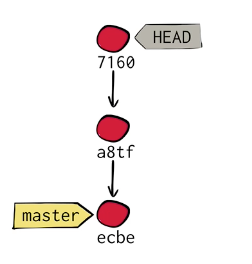

如果觉得代码不好，可以直接checkout会原来的分支：

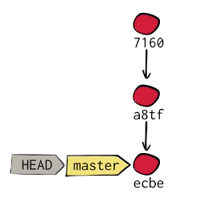

此时，刚才的那些commit我们只能通过SHA1来获取，且一段时候被“冷落”后，会被Git作为垃圾回收。

如果我们此时反悔了，还可以通过git checkout SHA1来回溯到刚才的commit，再在此commit处用`git branch`创建一个新的branch：`git branch nogood`

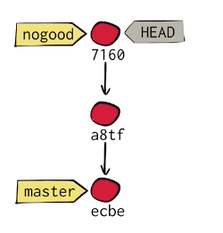

### 7. 小结

什么是Repo？Repo是一堆对象连接而成的图(graph)；

什么是Branch？Branch是指向某个Commit的引用；

什么是HEAD？HEAD是指向当前位置的引用，“当前位置”一般是某个Branch，也可以是Commit——Detached HEAD。

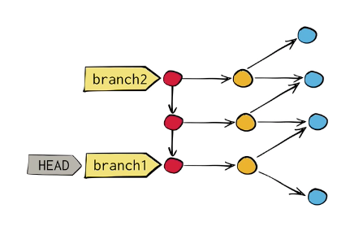

__Three Rules__：
* The current branch tracks new commits——每次在一个分支上提交时，分支也会跟着移动到最新的那个提交；
* When you move to another commit，Git updates your working directory；
* Unreachable objects are garbage collected。

## 三. Merge的孪生兄弟: Rebase

Rebase的作用类似于merge，都是合并分支。

### 1. 什么是rebase？

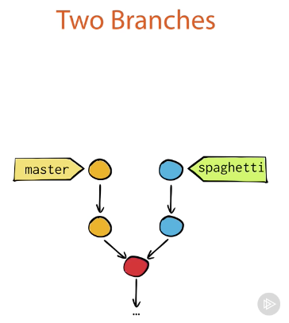

我们目前有两个branch：
* master：修改了一些apple pie的菜谱内容；
* spaghetti：添加了spaghetti的菜谱内容；
* 假设当前分支为spaghetti；

我们当然可以用merge命令将两个分支合并。

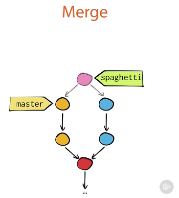

但是，我们还可以rebase命令：`git rebase master`
* 首先，Git会沿着spaghetti的路径查找第一个也是master的commit路径上的commit——图中红色的commit；
* 然后，Git将spaghetti的分支从该commit处切下；

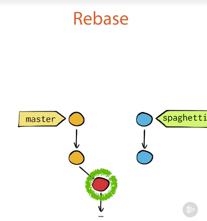

* 再将其补到master分支的上方，此时，spaghetti分支也有了master分支中的所有commits：

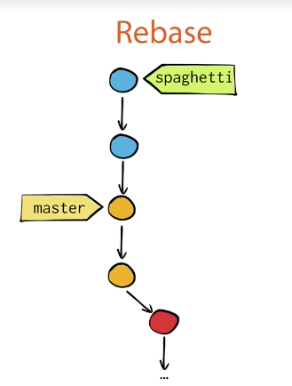

* 最后，我们可以checkout回master分支，fast-forword到spaghetti的commit位置，此时merge和rebase没有差别：

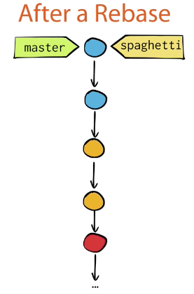

### 2. rebase的实质

rebase的实质并不是像上节描述的那样——从base处切断，再将其接到另一个分支上——因为在Git中，commits是database对象，是不可变的；而你要移动commits，则至少会改变其parent，那么肯定要改变其SHA1！

所以，Git将该link从base处复制一遍，改了SHA1，再接到master上：

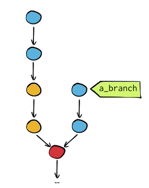

最后将rebased branch移动到新的那个commit上面：

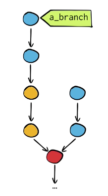

### 3. 垃圾回收

复制的那一串commits被移植，原来的旧的commits怎么处理？况且Branch也被移植走了，所以原来的那串commits几乎是unreachable的。Git会持续监视，如果一段时间你都没用去管这串commits的话，Git就会启动垃圾回收机制，删除这段旧的commits——garbage collection。

### 3. Merge的优劣

Rebase和Merge做的事情十分类似——they both enroll existing commit in the history of a branch.

例如：if I'm working on the apple pie recipe, and I want to also get the spaghetti recipe, I can have both in the same history by merging or rebasing.

Merge: it preserves history exactly as it happened.

In this case, for example, you can clearly see that the yellow commits and the blue commits were created independently, possibly in parallel, and then they were merged into one single timeline.

但是，对于大型项目而言，使用Merge可能使得结构变得十分混乱——a lot of branching, a lot of merging——很难去识别分支在哪里岔开，又在哪里合并。

另外`git log`把各个commits展示得像一条line，但实际上市一个graph，有一些commits并不在一个branch上，是平行的。所以可能导致误解。

综上，__merges preserve the project history__——merges never lie.

### 4. Rebase的优劣

使用rebase，可以使commits被排列在一条线上，很整洁、干净。但是如果看rebase的history，我们可能被欺骗。

For example, in this case, it looks like the yellow commits were created first, and blue commits were created later on top of them. But this is not what really happened. The yellow and blue commits were created in parallel in different branches.

因此，相较于merge，rebase在某种程度上改变了项目的历史。

Changing history = Creating new commits + Moving branches.

When in doubt, just merge.

### 5. Tags

Git有两种标签：
* annotated-tag
* lightweight-tag：不需要作者、时间这些多余信息，更加轻量级的tag

`git tag -a dinner`：创建名为dinner的annotated-tag

`git tag dinner`：创建名为dinner的lightweight-tag

tags都在`refs/tags`里。

tag和branch都是指向某个commit的引用，区别是：A tag is like a branch that doesn't move.

总结：
* branches、merges、rebases、tags——使Git从一个傻逼的文件追踪器变成版本管理系统。

## 四. 分布式

One computer → multiple computers

### 1. 与云端连通

使用`git clone [URL]`从云端将项目拷贝至本地电脑——本地仓库（local repo）。URL从Github上查看。

拷贝是拷贝`.git`文件夹，且这种拷贝并不是拷贝everything，例如：`git clone` only copies one branch, the master branch.

此后，Git将根据master branch的引用，构造工作区域。

### 2. 本地与远程

当使用`git clone`从远程拷贝Repo时，一些配置信息被添加了进来，如远程(remote)的名称、地址——名称默认为origin，地址是Github上的URL。

同时，我们有一个master分支，对应的是远程端的master分支。

同步时，Git需要知道远程端(origin)的状态——有哪些branch？这些branch又指向哪些commits？事实上，Git的确存储了remote的关于branch及其引用的信息。

`git branch`仅仅显示本地仓库的branch，使用`git branch --a`显示包括上一次同步时获取的远程仓库的branch(包括HEAD)，当然也有本地的master branch。

【具体在哪个位置就算了……】

每次与远程仓库连接时，remote branch的信息都会被更新。

`git show-ref [分支名]`：`git show-ref master`将打印出所有名称中含有`master`的分支——local master branch + the remote master branch.

A local branch in Git is just a reference to a commit. Well, a remote branch is exactly the same thing. Whenever you synchronize with the remote, Git updates remote branches.

### 3. Push: 推

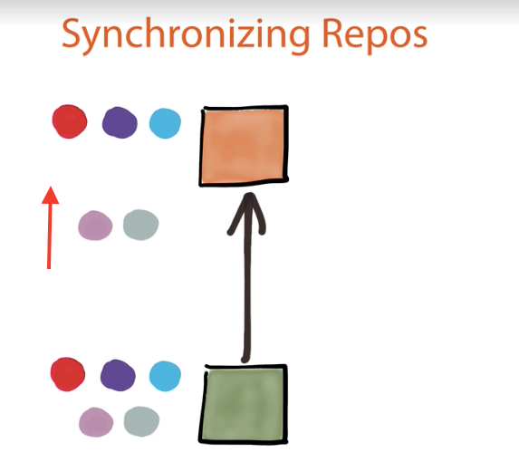

在remote未发生变化的情况下，local进行了一些修改，即生成了新的commits；此时同步，十分简单，只需将生成的这些commits拷贝过去即可。

同时，还有一些东西需要拷贝——Git also has to keep the branches synchronized on the various clones——保持branches同步。

例如：我修改了里层文件夹中的文本文件——新的blob，新的tree，新的commit，且本地的master branch会指向这个最新的commit；然而，remote(origin) master branch还停留在之前同步的位置。

因此，在Push的时候，我们不仅仅是push了新的objects，还同时push了最新的branch和HEAD。同时，因为remote端的master branch的更新，本地端的remote master branch也得到同步更新——Git updated our remote branches to align with the current state of origin.

### 4. Pull: 拉

Pull：read changes from the remote

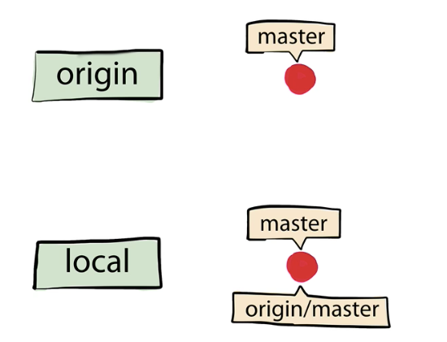

在local修改：

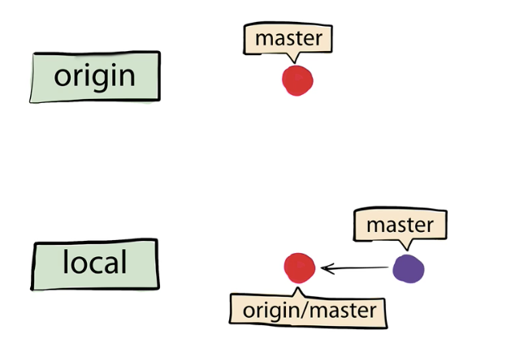

此时push到remote，先拷贝objects：

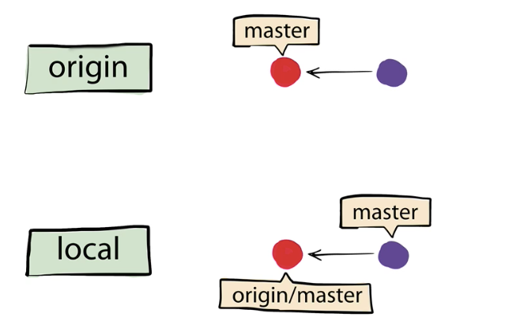

并将local master branch同步过去：

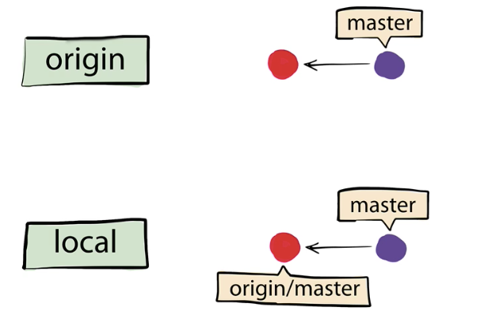

再feedback给本地，告知remote的master branch已经更新：

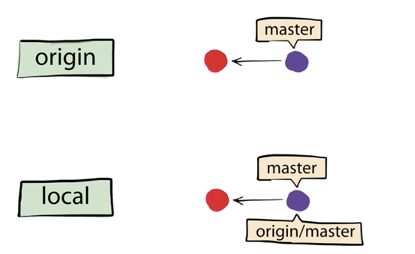

但是，在我们对local repo做出修改，刚刚想push的时候，我们不幸发现，其他人刚刚向remote push了新的修改——此时，冲突产生：

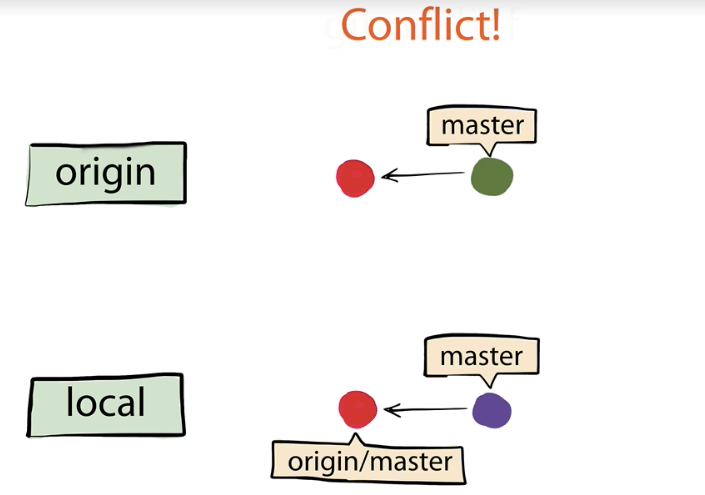

两种解决方案：

**第一，强制push**。

使用`git push -f `。该命令强制remote接受我们的修改：

1. 拷贝objects

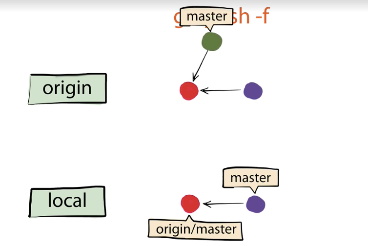

2. 同步master branch

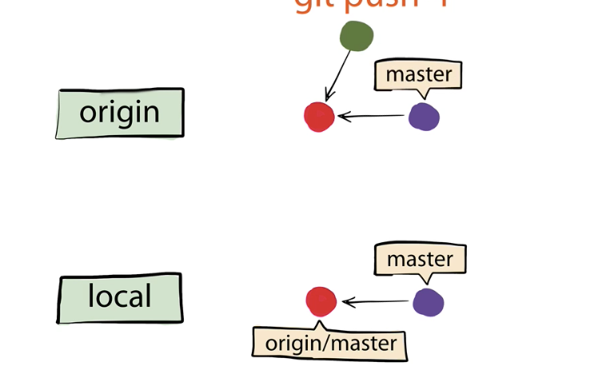

3. feedback remote master branch

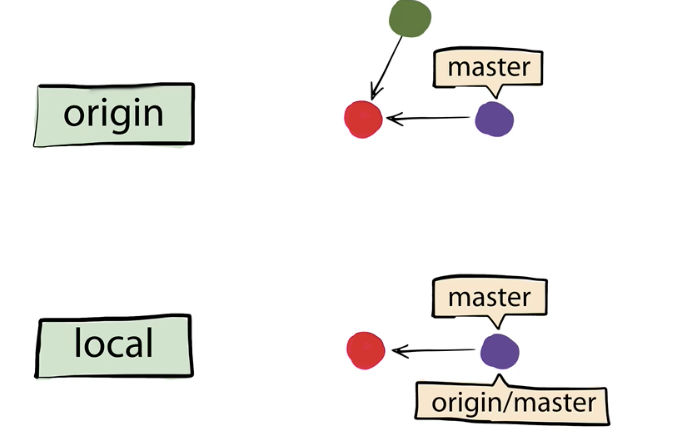

由于其他人的commit成为准unreachable状态，最终会被垃圾回收。

__第二，使用git fetch化解冲突__。

1. 将remote端的变化更新到local：

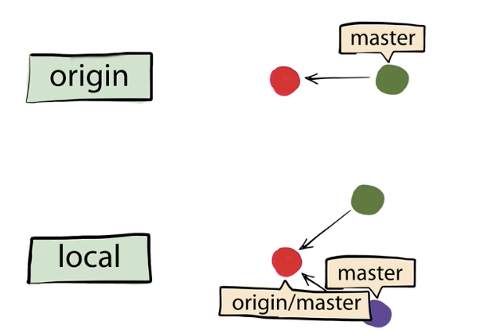

2. 在local更新remote master branch：

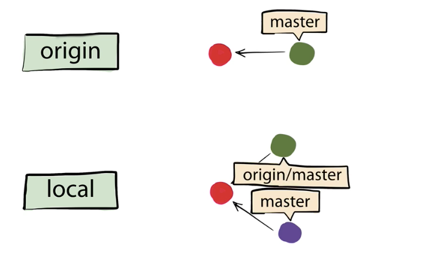

3. `git merge origin/master`

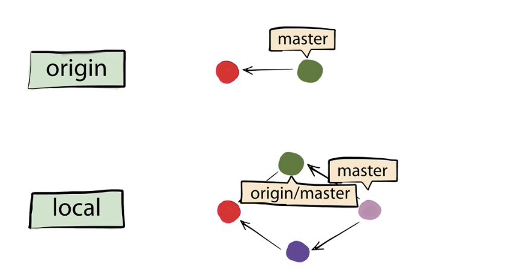

4. `git push`

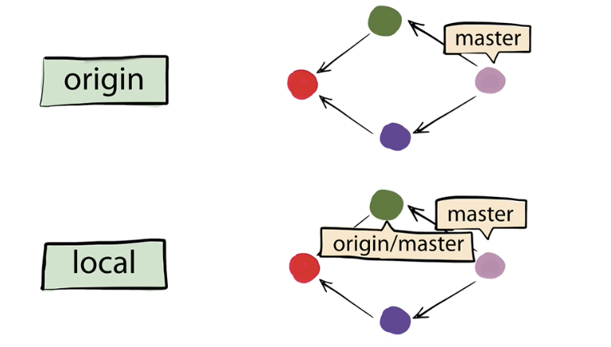

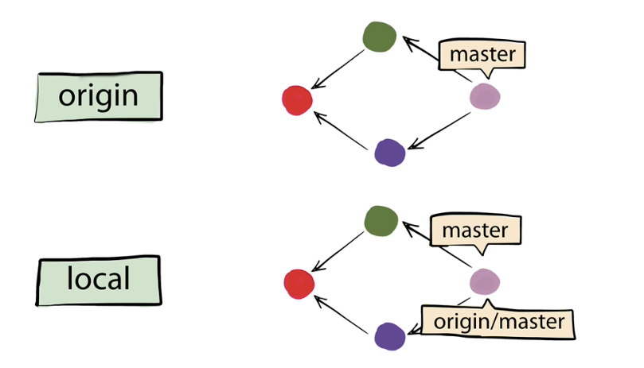

__小结__：This sequence of a git fetch followed by a git merge is so common that there is one single command that does both. It's called, you guessed it, git pull. A fetch followed by a merge.

### 5. About Rebase

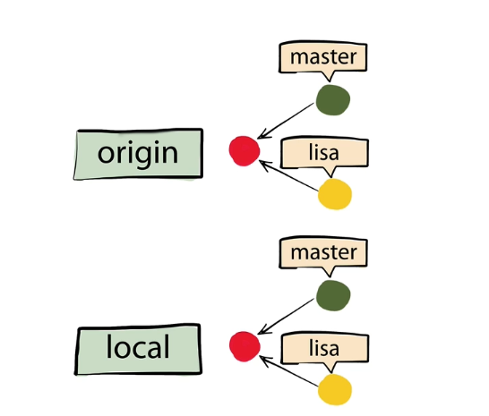

在本地，我们希望把master并到lisa上。很简单，使用`git rebase master`：

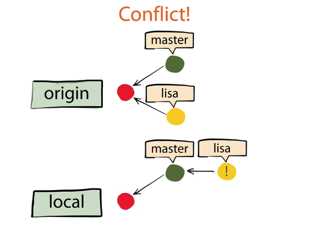

此时，如果我们要push到remote，会产生冲突。但这个冲突很好解决。解决之后：

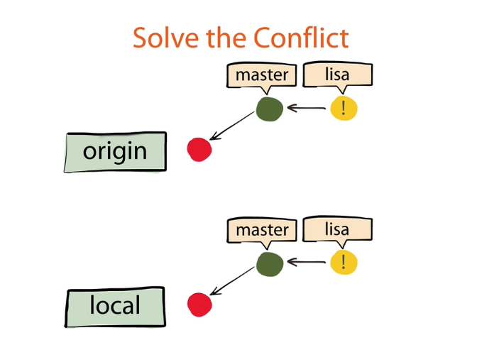

但对于另外一个开发者来说，情况会很糟糕：

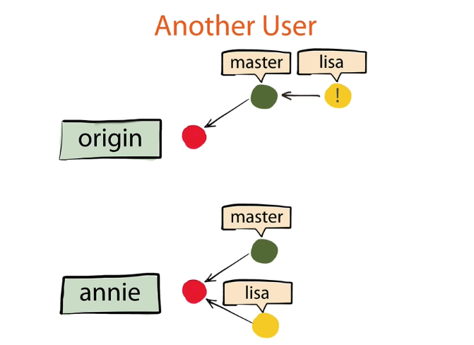

她本来就只负责lisa这个分支。有一天，她在自己的local做了新的commit：

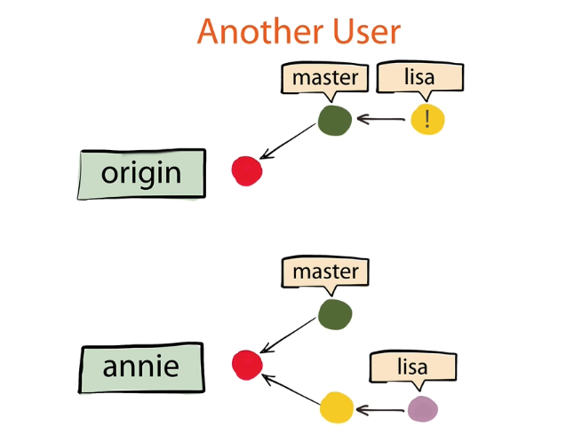

这时她要向remote同步，结果懵逼了，发现conflict？？？可她什么都没做啊。

所以，使用rebase的底线是：Never rebase stuff that has been shared with some other repository——永远不要在和别人共同工作的项目中用rebase！**Never rebase shared commits**。

### 6. Github Features

Github上不属于你的项目，你肯定不可以去push它。

但是我们可以在Github上Fork它：A fork is kind of like a clone, but it's a remote clone(Fork是一种像是clone的操作，但是一种远程clone)。什么意思呢？We are cloning the project from someone else's GitHub account to our own GitHub account——我们从别人的GitHub账户中拷贝项目到自己的账户中：

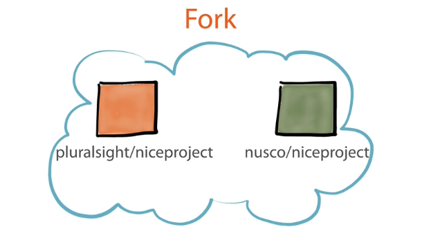

然后，我们可以clone这个自己账户里的别人的项目到local：

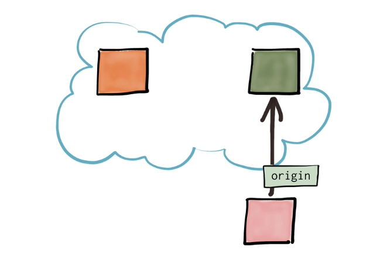

但是出现了一个问题：Git并不知道local的这个repo的original repo是什么。因此那位作者如果对项目进行了更新，local端无法得知，更无法同步更新。此时就需要手动把local和那个人的remote repo连接在一起——就如local和自己Github中的remote origin连接在一起一样。我们取那个人的remote名为upstream：

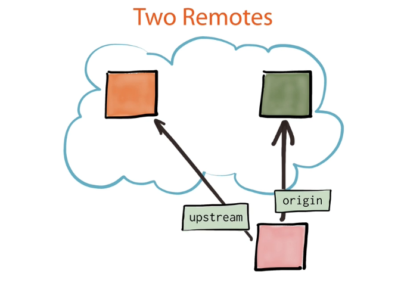

我们只能从upstream来pull新内容，不能push我们自己写的东西——因为我们没有写的权力，东西不是咱的。但是，Github提供了Pull Requests功能，允许我们向作者询问，是否接纳我们的修改：

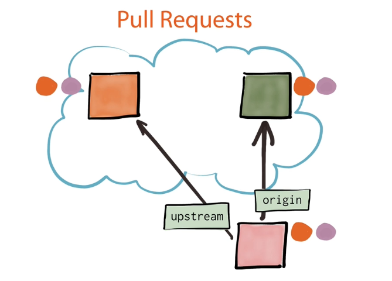